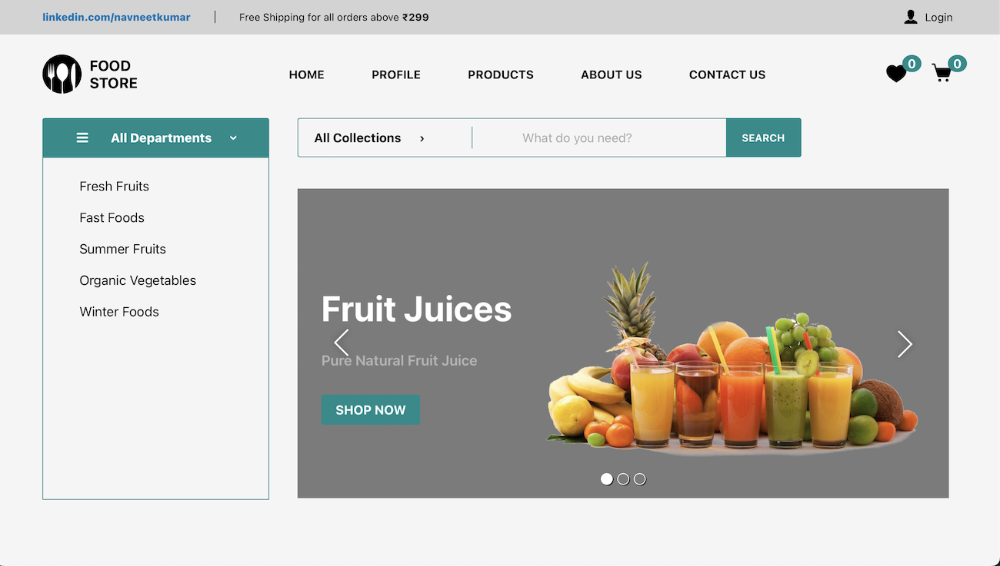

# **E Commerce App - MERN**
This is a an ECommerce Application designed in MERN Stack.
It enables the user to browse through products, and and remove from products from Cart and from Wishlist as well.

 

## **Features : User**
- User can login and logout using a email and password.
- User can add and remove product from Cart.
- User can add and remove product from Wishlist.
- User will be able to place the order.
- User can search among existing products using a keyword. 

 

## **Features : Admin**
- There is an admin dashboard which only an ADMIN can use.
- Admin can view, add, edit and delete products, users, collections, orders etc.

## 💻 **Tech Stack Used :**

### MERN Stack

    MongoDB - For collecting, saving all the data.
    Express JS - For backend.
    React JS - For frontend.
    Node JS - For writing backend apis
    JWT - To handle user authentication 

 

## **Screenshots :**

 

## **Deployed Link :**

 